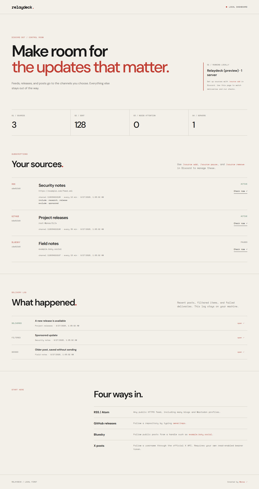

# Relaydeck

Relaydeck is a **Discord bot** that sends new posts from sources you choose to channels you choose. It began as Tweecord, a Twitter stream experiment. The old stream had hard-coded accounts and could broadcast to every text channel. Relaydeck replaces that with explicit subscriptions, slash commands, a persistent delivery log, and a local dashboard.

## What it supports

| Source | Input | Access |
| --- | --- | --- |
| RSS / Atom | `https://example.com/feed.xml` | Public HTTPS feed |
| GitHub releases | `owner/repository` | Public API; optional `GITHUB_TOKEN` |
| Bluesky posts | `handle.bsky.social` | Public API |
| X posts | `username` | Your `X_BEARER_TOKEN` with read access |

Many sites, including some Mastodon profiles and YouTube channels, provide RSS feeds. Add those as RSS sources. X is read through the official API; Relaydeck does not scrape accounts or promise free access to X posts.

For each source you can choose a channel, polling interval, include and exclude words, and a label. New subscriptions mark existing items as seen so a channel does not receive a backlog. Failed deliveries remain visible and are retried on a later check. The bot never needs the Message Content privileged intent.

## Set up the bot

1. Install **Node.js 24 or newer** and run `npm install` in this folder.
2. Create an application and bot in the [Discord Developer Portal](https://discord.com/developers/applications). Copy its bot token and application ID.
3. Invite it to your server with the `bot` and `applications.commands` scopes. Give it **View Channel**, **Send Messages**, and **Embed Links** in channels where it should post.
4. Copy `.env.example` to `.env` and fill in `DISCORD_TOKEN` and `DISCORD_CLIENT_ID`. During setup, set `DISCORD_GUILD_ID` to your server ID so slash commands appear immediately. Without it, commands are registered globally and can take time to appear.
5. Run `npm start`. The bot and local dashboard run in the same process. Open `http://127.0.0.1:4317` on that computer.

`.env` and the SQLite database in `data/` are ignored by Git. Keep the bot token, X token, and database private. The dashboard listens on loopback only and is intended for the computer running the bot.

## Commands

- `/source preview type value` — inspect recent items before subscribing.
- `/source add type value channel [name] [include] [exclude] [minutes]` — subscribe a channel. You need **Manage Server**.
- `/source list` — list source IDs, channels, and errors.
- `/source update id [channel] [name] [include] [exclude] [minutes]` — edit a subscription without losing its history. Use `-` to clear a filter.
- `/source check id` — poll immediately.
- `/source pause id`, `/source resume id`, `/source remove id` — manage a source.
- `/relay-status` — see active sources and recent deliveries.
- `/relay-help` — show help in Discord.

Use a full ID or its unique first characters from `/source list`. Include and exclude are comma-separated phrases. Include matches when **any** phrase appears in the title or summary; exclude wins if **any** phrase appears. The default interval is 10 minutes, or 60 minutes for X. The allowed range is 5–1440 minutes.

The local dashboard shows source health, recent deliveries, errors, and a **Check now** action. Subscription changes happen in Discord so server permissions are respected.

## Reliability and limits

- SQLite stores sources and item IDs across restarts. One process should use the database at a time.
- Each check processes up to 10 unseen items; older items are seeded on first use. Duplicate IDs are never reposted after a successful delivery.
- Discord delivery uses embeds with mentions disabled. A missing channel or permission error is recorded instead of silently sending elsewhere.
- RSS feeds must use public HTTPS URLs. The fetcher rejects local network addresses, limits redirects, response size, and request time.
- GitHub and Bluesky have their own rate limits. X API access and pricing are controlled by X; configure a longer interval if needed.
- The local dashboard is a monitor for a running bot. It is not a hosted web service and does not need a separate Vercel deployment.

Run `npm test` for parsing, filtering, validation, and persistence checks.
Run `npm run preview` to inspect the dashboard with sample data without a Discord token.

## Built with

Node.js, [discord.js](https://discord.js.org/), [fast-xml-parser](https://github.com/NaturalIntelligence/fast-xml-parser), and Node's built-in SQLite module. The local dashboard uses plain HTML, CSS, and JavaScript.

## License

The original repository was published under CC0-1.0. See [LICENSE](LICENSE).
